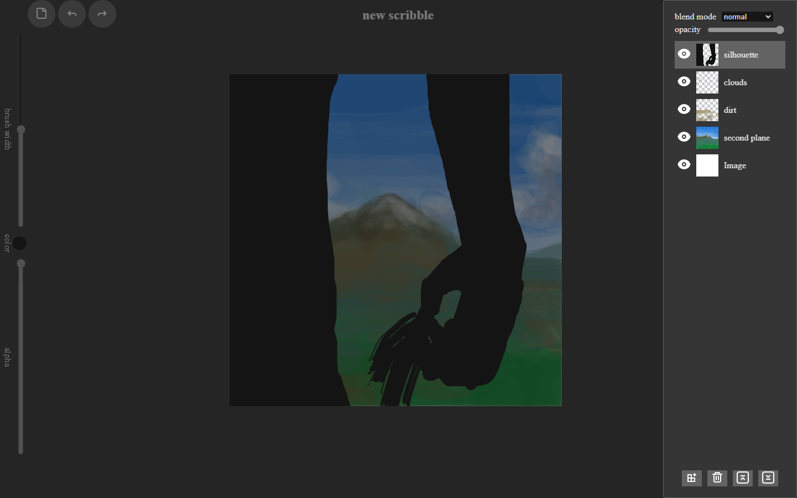

# 

A simple PWA sketching APP for mobile and desktop with custom brushes and multilayer support



## Live Demo

[Live App Link](https://juanlpalacios.github.io/Scribbles/)

### Install Scribbles

You can install the app from the "Quick Start" modal under the "More Resources" section or from the URL bar.

### Features

- tools
  - draw
  - erase
  - fill
  - smear
  - cut(move/scale/rotate)
    - rectangular cut
    - laso cut
- multilayer support
  - layer opacity
  - compositing operations
- saving
  - zip-based multilayer format(.scribble)
  - local web storage saving
  - export to png
- custom brushes
  - solid brushes
  - texture brushes
  - marker brushes
  - pattern brushes
  - zip-based brush format(.sbr)

### Setup local build

First clone the repository

```
npm clone https://github.com/JuanLPalacios/Scribbles.git
```

to set it up you have to first install the dependencies. run 

```
npm install
```

after that you can run the local development server with:
```
npm start
```

## Built With

- React
- TypeScript
- CSS
- ABR-JS
- JSZip
- file-saver

## Author

👤 **Juan Luis Palacios**

- GitHub: [@JuanLPalacios](https://github.com/JuanLPalacios)
- Twitter: [@JuanLuisPalac20](https://twitter.com/twitterhandle)
- LinkedIn: [LinkedIn](https://www.linkedin.com/in/juan-luis-palacios-p%C3%A9rez-95b39a228/)


## 🤝 Contributing

Contributions, issues, and feature requests are welcome!

Feel free to check the [issues page](../../issues/).

## Show your support

Give a ⭐️ if you like this project!

## Acknowledgments

- [TurboColors](https://instagram.com/turbocolors?igshid=ZDdkNTZiNTM=) for the logo original design
- [Michaelampr](https://github.com/michaelampr/jam?ref=svgrepo.com) Vectors and icons in MIT License via [SVG Repo](https://www.svgrepo.com/)
- [Css.gg](https://github.com/astrit/css.gg?ref=svgrepo.com) Vectors and icons in MIT License via [SVG Repo](https://www.svgrepo.com/)
- [Boxicons](https://github.com/atisawd/boxicons?ref=svgrepo.com) Vectors and icons in CC Attribution (CC-BY) License via [SVG Repo](https://www.svgrepo.com/)

## 📝 License

This project is [MIT](./MIT.md) licensed.